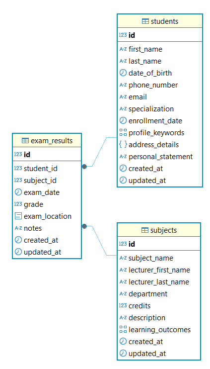

## Schema creation

ERD:



Tested data created with [db-populate-function.sql](../sql-scripts/tables-and-data/db-populate-function.sql)

## Indexes analysis

### B-tree

**No index**

```sql
EXPLAIN ANALYZE
SELECT *
FROM students s
WHERE s.last_name = 'Moore';

--output
Seq Scan ON students s  (COST=0.00..5595.00 ROWS=8350 width=309) (actual TIME=0.048..21.860 ROWS=8382 loops=1)
  FILTER: ((last_name)::TEXT = 'Moore'::TEXT)
  ROWS Removed BY FILTER: 91618
Planning TIME: 0.060 MS --PostgreSQL took to plan the query — quite fast
Execution TIME: 22.094 MS --start to finish, including scanning, filtering, and returning rows
```

**With index**

```sql
CREATE INDEX idx_students_last_name ON students (last_name);

EXPLAIN ANALYZE
SELECT *
FROM students s
WHERE s.last_name = 'Moore';

--out
Bitmap Heap Scan ON students s  (COST=97.01..4587.46 ROWS=8350 width=309) (actual TIME=1.207..4.137 ROWS=8382 loops=1)
  RECHECK Cond: ((last_name)::TEXT = 'Moore'::TEXT)
  Heap Blocks: exact=3783
  ->  Bitmap INDEX Scan ON idx_students_last_name  (COST=0.00..94.92 ROWS=8350 width=0) (actual TIME=0.934..0.935 ROWS=8382 loops=1)
        INDEX Cond: ((last_name)::TEXT = 'Moore'::TEXT)
Planning TIME: 0.324 ms
Execution TIME: 4.394 ms
```

x5 time improvement!

### Hash index

**Without index equals**

```sql
EXPLAIN ANALYZE
SELECT *
FROM students s
WHERE s.last_name = 'Moore';

--out
Seq Scan ON students s  (COST=0.00..5595.00 ROWS=8350 width=309) (actual TIME=0.071..17.256 ROWS=8382 loops=1)
  FILTER: ((last_name)::TEXT = 'Moore'::TEXT)
  ROWS Removed BY FILTER: 91618
Planning TIME: 0.353 MS
Execution TIME: 17.490 MS
```

**Without index like**

```sql
EXPLAIN ANALYZE
SELECT *
FROM students s
WHERE s.last_name ILIKE 'M%';

--out
Seq Scan ON students s  (COST=0.00..5595.00 ROWS=16670 width=309) (actual TIME=0.017..40.386 ROWS=16605 loops=1)
  FILTER: ((last_name)::TEXT ~~* 'M%'::TEXT)
  ROWS Removed BY FILTER: 83395
Planning TIME: 0.257 MS
Execution TIME: 40.765 MS
```

**With hash**

**Equals**

```sql
EXPLAIN ANALYZE
SELECT *
FROM students s
WHERE s.last_name = 'Moore';

--out
Bitmap Heap Scan ON students s  (COST=316.71..4807.17 ROWS=8350 width=309) (actual TIME=0.974..5.334 ROWS=8382 loops=1)
  RECHECK Cond: ((last_name)::TEXT = 'Moore'::TEXT)
  Heap Blocks: exact=3783
  ->  Bitmap INDEX Scan ON idx_students_last_name  (COST=0.00..314.62 ROWS=8350 width=0) (actual TIME=0.702..0.703 ROWS=8382 loops=1)
        INDEX Cond: ((last_name)::TEXT = 'Moore'::TEXT)
Planning TIME: 0.113 ms
Execution TIME: 5.654 ms
```

**Like**
*Index is not used, even its avaliable*

```sql
EXPLAIN ANALYZE
SELECT *
FROM students s
WHERE s.last_name ILIKE 'M%';

--out
Seq Scan ON students s  (COST=0.00..5595.00 ROWS=16670 width=309) (actual TIME=0.016..41.654 ROWS=16605 loops=1)
  FILTER: ((last_name)::TEXT ~~* 'M%'::TEXT)
  ROWS Removed BY FILTER: 83395
Planning TIME: 0.305 MS
Execution TIME: 42.032 MS
```

